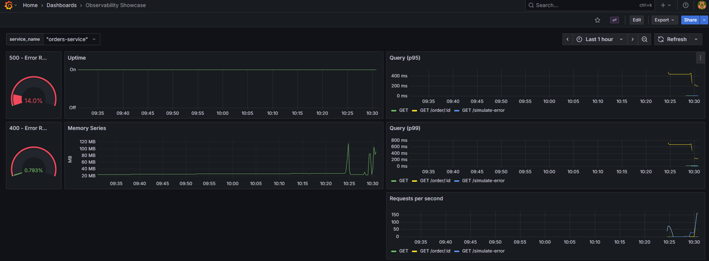
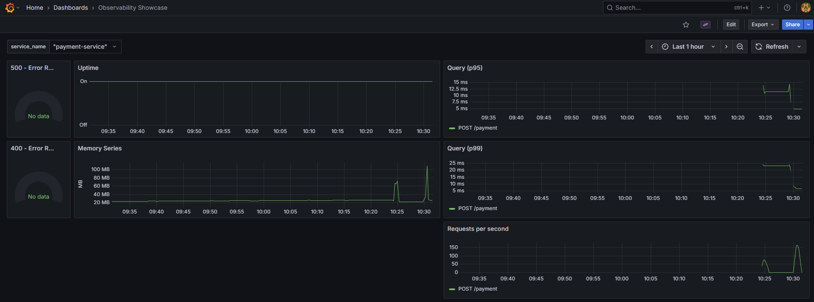

# 🔭 Observability Showcase

[](https://nodejs.org/) [](https://www.docker.com/)
[](https://opentelemetry.io/) [](https://prometheus.io/) [](https://grafana.com/) [](https://www.jaegertracing.io/)
[](https://www.elastic.co/logstash/) [](https://www.elastic.co/elasticsearch/) [](https://www.elastic.co/kibana/) 


> This project showcases a complete observability stack using OpenTelemetry, Prometheus, Grafana, Jaeger and the ELK Stack.
> It simulates a microservices environment with orders-service and payment-service generating logs, traces, and metrics.

---

## 🚀 Features

* Distributed Tracing using OpenTelemetry + Jaeger
* Centralized Logging with Filebeat → Logstash → Elasticsearch → Kibana
* Metrics Monitoring through OpenTelemetry + Prometheus + Grafana
* Node.js Microservices instrumented with OTEL and ECS logging
* Docker Compose setup for full local observability stack
* Extensible — add new services and see them instantly observable

---

## 🛠️ Tech Stack

* **Tracing**:	OpenTelemetry Collector + Jaeger
* **Metrics**:	Prometheus + Grafana
* **Logging**:	Filebeat + Logstash + Elasticsearch + Kibana
* **Services**:	Node.js (Orders + Payment) with Pino + ECS format
* **Containerization**:	Docker + Docker Compose

---

## 🏗️ Project Structure
.
├── docker-compose.yml
├── otel-collector/
│   └── otel-config.yml         # OTEL pipelines (traces + metrics)
├── prometheus/
│   └── prometheus.yml          # Prometheus scraping config
├── grafana/
│   ├── provisioning/           # Dashboards and datasources
│   └── dashboards/
├── logstash/
│   └── pipeline/
│       └── logstash.conf       # Log ingestion pipeline
├── filebeat/
│   └── filebeat.yml            # Docker container log collector
├── services/
│   ├── orders-service/         # Node.js service with tracing + logging
│   │   ├── index.js
│   │   └── otel-config.js
│   └── payment-service/        # Node.js service receiving requests
│       ├── index.js
│       └── otel-config.js
└── README.md

---

## 🧱 Architecture Overview

```mermaid
graph TD
    A[🛍 Orders Service] -->|POST /payment| B[💳 Payment Service]
    A -->|OTLP Export| C[🟣 OpenTelemetry Collector]
    B -->|OTLP Export| C

    C --> D[📈 Prometheus]
    C --> E[📡 Jaeger]
    A --> F[🪵 Filebeat]
    B --> F

    F --> G[⚙️ Logstash]
    G --> H[🧩 Elasticsearch]
    H --> I[📊 Kibana]
    D --> J[📊 Grafana]
```
    
---

## ⚡ Getting Started

### Prerequisites

* Docker & Docker Compose
* Node.js v22+
* npm

### Run the stack

```bash
docker compose up --build
```

This will:
Start all observability services (ELK, Prometheus, Grafana, Jaeger)
Build and run both Node.js microservices
Automatically wire OTEL, logs, and metrics pipelines

---

## 🧩 Services Overview
<table>
  <thead>
    <tr>
      <th>Service</th>
      <th>Port</th>
      <th>Purpose</th>
    </tr>
  </thead>
  <tbody>
    <tr>
      <td>Orders Service</td>
      <td>3000</td>
      <td>Sends payment requests and logs activity</td>
    </tr>
    <tr>
      <td>Payment Service</td>
      <td>3002</td>
      <td>Handles payments and emits observability data</td>
    </tr>
    <tr>
      <td>Jaeger UI</td>
      <td>16686</td>
      <td>View distributed traces</td>
    </tr>
    <tr>
      <td>Prometheus</td>
      <td>9090</td>
      <td>Raw metrics explorer</td>
    </tr>
    <tr>
      <td>Grafana</td>
      <td>3001</td>
      <td>Dashboards for metrics visualization</td>
    </tr>
    <tr>
      <td>Kibana</td>
      <td>5601</td>
      <td>Search and filter logs</td>
    </tr>
    <tr>
      <td>Elasticsearch</td>
      <td>9200</td>
      <td>Log storage and indexing</td>
    </tr>
  </tbody>
</table>


---

## 🧪 Testing the System

Create an Order
```bash
curl http://localhost:3000/order/123
```

You should see:
A payment request sent to payment-service

Logs in Kibana

Traces in Jaeger

Metrics in Prometheus/Grafana

Simulate an Error
```bash
curl http://localhost:3000/simulate-error
```

This triggers:
An error log sent to ELK
A failed span in Jaeger

---

## 📊 Observability Views
<table>
  <thead>
    <tr>
      <th>Tool</th>
      <th>URL</th>
      <th>Description</th>
    </tr>
  </thead>
  <tbody>
    <tr>
      <td>Grafana</td>
      <td><a href="http://localhost:3001">http://localhost:3001</a></td>
      <td>Dashboards and metrics visualization</td>
    </tr>
    <tr>
      <td>Jaeger</td>
      <td><a href="http://localhost:16686">http://localhost:16686</a></td>
      <td>Distributed traces explorer</td>
    </tr>
    <tr>
      <td>Kibana</td>
      <td><a href="http://localhost:5601">http://localhost:5601</a></td>
      <td>Centralized logs search</td>
    </tr>
    <tr>
      <td>Prometheus</td>
      <td><a href="http://localhost:9090">http://localhost:9090</a></td>
      <td>Metrics query engine</td>
    </tr>
  </tbody>
</table>

---

## 📸 Screenshots
[](./screenshots/dashboard-orders-service.PNG)
[](./screenshots/dashboard-payment-service.PNG)
	
---

## 🏆 Project Highlights

* **Unified Observability**: Logs, Metrics & Traces integrated end-to-end
* **Educational Setup**: Ideal for learning OTEL, ELK, and Grafana
* **Extensible Design**: Add more microservices easily
* **Fully Dockerized**: One command, full environment